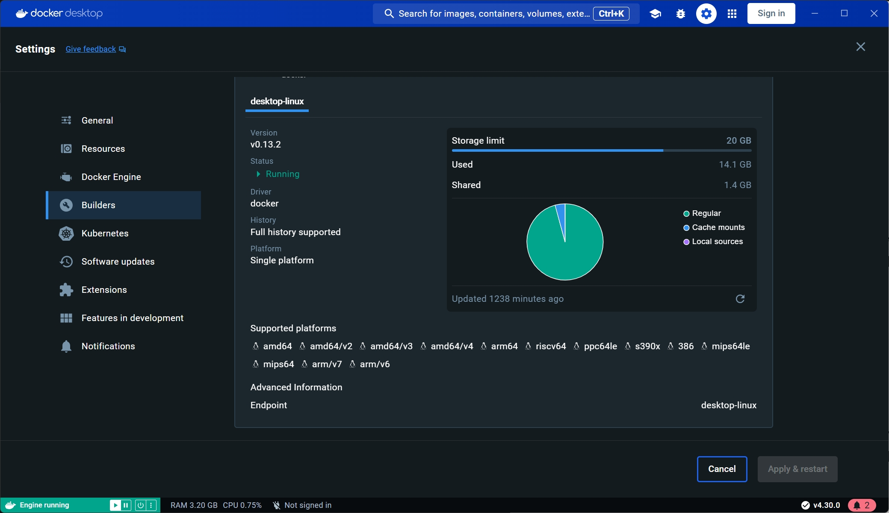

# Docker 支持运行不同架构容器

## 安装 qemu
```
sudo apt-get update
sudo apt-get install -y qemu-user-static binfmt-support
```

> qemu-user-static 是一个用于在 Linux 系统上运行非本机架构（cross-architecture）二进制文件的工具。它是 QEMU（Quick Emulator）的一部分，专注于用户态模拟（user-mode emulation），允许你在一个架构的系统上运行另一种架构的二进制文件，而无需完整的虚拟机或系统级模拟。

> binfmt-support 是一个用于管理 Linux 内核 binfmt_misc 模块的工具，主要用于支持运行非本机架构的二进制文件。它在跨架构容器运行（如 Docker）和开发测试中非常有用。通过结合 QEMU 模拟器，它可以实现无缝的多架构支持。


## 注册 qemu
```
docker run --rm --privileged multiarch/qemu-user-static --reset -p yes
```

## 检查安装
```
docker buildx inspect --bootstrap | grep Platforms
```
可以看到支持了以下架构:
```
Platforms:        linux/amd64, linux/amd64/v2, linux/amd64/v3, linux/amd64/v4, linux/arm64, linux/riscv64, linux/ppc64le, linux/s390x, linux/386, linux/mips64le, linux/mips64, linux/arm/v7, linux/arm/v6
```
或者可以在 docker builds 界面看到支持的架构
